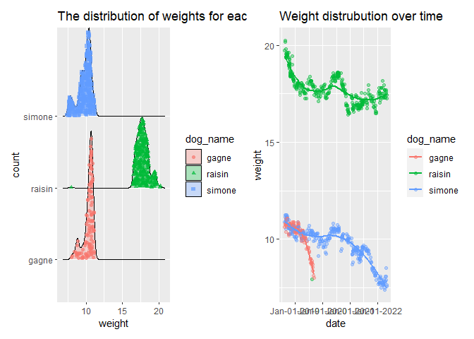

p8105_mtp_jc5929
================
2022-10-22

``` r
library(tidyverse)
```

    ## ── Attaching packages ─────────────────────────────────────── tidyverse 1.3.2 ──
    ## ✔ ggplot2 3.3.6      ✔ purrr   0.3.4 
    ## ✔ tibble  3.1.8      ✔ dplyr   1.0.10
    ## ✔ tidyr   1.2.0      ✔ stringr 1.4.1 
    ## ✔ readr   2.1.2      ✔ forcats 0.5.2 
    ## ── Conflicts ────────────────────────────────────────── tidyverse_conflicts() ──
    ## ✖ dplyr::filter() masks stats::filter()
    ## ✖ dplyr::lag()    masks stats::lag()

``` r
library(dplyr)
library(knitr)
library(readxl)
library(ggridges)
library(patchwork)
```

**Cleaning data set**

``` r
dog_data= read_excel("data/dogweights_07may2022.xlsx",skip = 1,col_types = 
                   c("date", "guess", "guess", "guess", "guess", "text")) %>% 
  janitor::clean_names() %>% 
  drop_na(date) %>% 
  subset(raisin != "NA" | simone != "NA" | gagne != "NA") %>% 
  select(-x6) %>% 
  separate(date,into=c("year","month","day"),sep="-") %>% 
  separate(raisin,into=c("lbs","oz"),sep=2)%>%
  mutate(lbs=as.numeric(lbs), oz=as.numeric(oz)) %>%
  mutate(raisin=round((lbs+oz/16),2))%>%
  select(-lbs,-oz) %>%
  separate(simone, into=c("lbs","oz"),sep=2) %>%
  mutate(lbs=as.numeric(lbs), oz=as.numeric(oz)) %>%
  mutate(simone=round((lbs+oz/16),2))%>%
  select(-lbs,-oz) %>%
  separate(gagne, into=c("lbs","oz"),sep=2) %>%
  mutate(lbs=as.numeric(lbs), oz=as.numeric(oz)) %>%
  mutate(gagne=round((lbs+oz/16),2)) %>%
  select(-lbs,-oz) %>% 
  separate(std, into=c("lbs","oz"),sep=2) %>%
  mutate(lbs=as.numeric(lbs), oz=as.numeric(oz)) %>%
  mutate(std=round((lbs+oz/16),2)) %>%
  select(-lbs,-oz) %>% 
  pivot_longer(
    raisin:gagne,
    names_to = "dog_name",
    values_to = "weight"
  )                  %>%
  drop_na(weight) %>%
  relocate(std,.after=weight)
```

    ## Warning: Expecting date in B79 / R79C2: got 's'

    ## New names:
    ## • `` -> `...6`

**Creating a dataframe with notes**

``` r
notes_df= read_excel("data/dogweights_07may2022.xlsx", skip = 1, col_types = 
                    c("date", "guess", "guess", "guess", "guess", "text")) %>% 
  janitor::clean_names() %>% 
  mutate(notes = x6) %>%
  drop_na(notes) %>%
  select(date,notes) %>%
  select(date, notes) %>% 
  separate(date, into=c("year", "month", "day"),sep="-")
```

    ## Warning: Expecting date in B79 / R79C2: got 's'

    ## New names:
    ## • `` -> `...6`

**Export data sets**

``` r
write_csv(dog_data, "data/dog.csv")
write_csv(notes_df, "data/notes.csv")
```

\*Summary of the data set\*\*

``` r
 dog_data%>%
   distinct(year,month,day)
```

    ## # A tibble: 356 × 3
    ##    year  month day  
    ##    <chr> <chr> <chr>
    ##  1 2018  08    12   
    ##  2 2018  08    19   
    ##  3 2018  08    22   
    ##  4 2018  08    24   
    ##  5 2018  08    27   
    ##  6 2018  08    29   
    ##  7 2018  08    31   
    ##  8 2018  09    02   
    ##  9 2018  09    03   
    ## 10 2018  09    04   
    ## # … with 346 more rows

``` r
dog_data%>%
  group_by(dog_name) %>%
  summarize(obs=n(),
            avg_weight=mean(weight),
            sd_weight=sd(weight)) %>%
knitr::kable()
```

| dog_name | obs | avg_weight | sd_weight |
|:---------|----:|-----------:|----------:|
| gagne    | 119 |  10.293193 | 0.7079380 |
| raisin   | 355 |  17.786282 | 0.9348713 |
| simone   | 333 |   9.788709 | 0.9162902 |

**Visualization**

``` r
plot1=dog_data %>%
  group_by(dog_name,weight) %>%
  ggplot(aes(x=weight,y=dog_name,fill=dog_name))+
  geom_density_ridges(
    aes(point_color = dog_name, point_shape = dog_name,point_fill=dog_name),
    alpha = .3, point_alpha = 0.7, jittered_points = TRUE
  ) +labs(title = "The distribution of weights for each dog",
    x = "weight",
    y = "count")


dog_df1= dog_data%>%
  mutate(date=as.Date(with(dog_data,paste(year,month,day,sep="-"),"%Y-%m-%d")))%>%
  select(-year,-month,-day) 
 
plot2= dog_df1 %>%
  group_by(dog_name,weight) %>%
  ggplot(aes(x=date,y=weight,color=dog_name))+geom_point(alpha=0.4)+ 
  geom_smooth(alpha=0.4, se=FALSE) +labs(title = "Weight distrubution over time",
       x = "date",
       y = "weight")+scale_x_date(date_labels = "%b-%d-%Y")
                                        
  
plot1+plot2
```

    ## Picking joint bandwidth of 0.204

    ## `geom_smooth()` using method = 'loess' and formula 'y ~ x'

<!-- -->

``` r
dog_data
```

    ## # A tibble: 807 × 6
    ##    year  month day   dog_name weight   std
    ##    <chr> <chr> <chr> <chr>     <dbl> <dbl>
    ##  1 2018  08    12    raisin     19.8  NA  
    ##  2 2018  08    12    simone     10.9  NA  
    ##  3 2018  08    12    gagne      10.6  NA  
    ##  4 2018  08    19    raisin     20.2  21.0
    ##  5 2018  08    19    simone     11.1  21.0
    ##  6 2018  08    19    gagne      10.8  21.0
    ##  7 2018  08    22    raisin     20.2  21.0
    ##  8 2018  08    22    simone     11.2  21.0
    ##  9 2018  08    22    gagne      10.8  21.0
    ## 10 2018  08    24    raisin     19.8  21.0
    ## # … with 797 more rows
