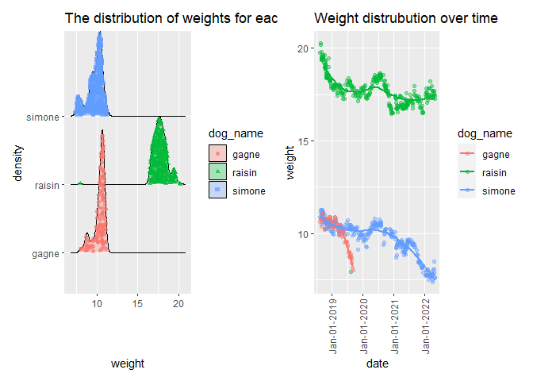

Midterm Project
================
2022-10-22

``` r
library(tidyverse)
```

    ## ── Attaching packages ─────────────────────────────────────── tidyverse 1.3.2 ──
    ## ✔ ggplot2 3.3.6      ✔ purrr   0.3.5 
    ## ✔ tibble  3.1.8      ✔ dplyr   1.0.10
    ## ✔ tidyr   1.2.0      ✔ stringr 1.4.1 
    ## ✔ readr   2.1.2      ✔ forcats 0.5.2 
    ## ── Conflicts ────────────────────────────────────────── tidyverse_conflicts() ──
    ## ✖ dplyr::filter() masks stats::filter()
    ## ✖ dplyr::lag()    masks stats::lag()

``` r
library(dplyr)
library(knitr)
library(readxl)
library(ggridges)
library(patchwork)
```

**Project goal**

This project aims to analyze the weight of the three dogs from 2018 to
2022.

**Cleaning data set**

``` r
dog_data= read_excel("data/dogweights_07may2022.xlsx",skip = 1,col_types = 
                   c("date", "guess", "guess", "guess", "guess", "text")) %>% 
  janitor::clean_names() %>% 
  drop_na(date) %>% 
  subset(raisin != "NA" | simone != "NA" | gagne != "NA") %>% 
  select(-x6) %>% 
  separate(date,into=c("year","month","day"),sep="-") %>% 
  separate(raisin,into=c("lbs","oz"),sep=2)%>%
  mutate(lbs=as.numeric(lbs), oz=as.numeric(oz)) %>%
  mutate(raisin=round((lbs+oz/16),2))%>%
  select(-lbs,-oz) %>%
  separate(simone, into=c("lbs","oz"),sep=2) %>%
  mutate(lbs=as.numeric(lbs), oz=as.numeric(oz)) %>%
  mutate(simone=round((lbs+oz/16),2))%>%
  select(-lbs,-oz) %>%
  separate(gagne, into=c("lbs","oz"),sep=2) %>%
  mutate(lbs=as.numeric(lbs), oz=as.numeric(oz)) %>%
  mutate(gagne=round((lbs+oz/16),2)) %>%
  select(-lbs,-oz) %>% 
  separate(std, into=c("lbs","oz"),sep=2) %>%
  mutate(lbs=as.numeric(lbs), oz=as.numeric(oz)) %>%
  mutate(std=round((lbs+oz/16),2)) %>%
  select(-lbs,-oz) %>% 
  pivot_longer(
    raisin:gagne,
    names_to = "dog_name",
    values_to = "weight"
  )                  %>%
  drop_na(weight) %>%
  relocate(std,.after=weight)
```

    ## New names:
    ## • `` -> `...6`

The raw data was in excel format and the “Date” variable has multiple
forms of expressions.So I unified them into a single format. Then I
dropped the row that has no date information, I also dropped the rows
that has NA in all three dogs’ weight, as these data will be useless for
our further analysis.

Next, I tried to format the weight into pounds. I have separated the
columns raisin, simone, and gagne by whitespace, respectively, into two
columns lbs and oz. Then I divided the oz by 16, and add it with the lbs
column. This whole step was done three times for the three dogs.

Realizing that the original data was in a wide format where all three
dogs’ names are the column names, which is not tidy. I make it into a
long format by replacing the three dogs’s names into two columns,
dog_name and weight. I also deleted the rows that has NA in the weight
column. Finally, I rearrange the column sequence in order for a better
view.

Below step is to create another data frame containing notes and date,
and save both into csv files.

**Creating data frame**

``` r
notes_df= read_excel("data/dogweights_07may2022.xlsx", skip = 1, col_types = 
                    c("date", "guess", "guess", "guess", "guess", "text")) %>% 
  janitor::clean_names() %>% 
  mutate(notes = x6) %>%
  drop_na(notes) %>%
  select(date,notes) %>%
  select(date, notes) %>% 
  separate(date, into=c("year", "month", "day"),sep="-")
```

    ## New names:
    ## • `` -> `...6`

``` r
write_csv(dog_data, "data/dog.csv")
write_csv(notes_df, "data/notes.csv")
```

**Data set Summary**

``` r
 dog_data%>%
   distinct(year,month,day)
```

    ## # A tibble: 356 × 3
    ##    year  month day  
    ##    <chr> <chr> <chr>
    ##  1 2018  08    12   
    ##  2 2018  08    19   
    ##  3 2018  08    22   
    ##  4 2018  08    24   
    ##  5 2018  08    27   
    ##  6 2018  08    29   
    ##  7 2018  08    31   
    ##  8 2018  09    02   
    ##  9 2018  09    03   
    ## 10 2018  09    04   
    ## # … with 346 more rows

In the tidy data set dog_data, it contains 807 rows, and 6 columns. The
rows represents the weight information for a single dog on a specific
date. The columns includes variables of the year, month, day, dog name,
weight, and the weight of a standard object. There are 356 unique dates
included. Below is a table showing the number of observations for each
dog, along with their average weight and standard deviation.

``` r
dog_data%>%
  group_by(dog_name) %>%
  summarize(obs=n(),
            avg_weight=mean(weight),
            sd_weight=sd(weight)) %>%
knitr::kable()
```

| dog_name | obs | avg_weight | sd_weight |
|:---------|----:|-----------:|----------:|
| gagne    | 119 |  10.293193 | 0.7079380 |
| raisin   | 355 |  17.786282 | 0.9348713 |
| simone   | 333 |   9.788709 | 0.9162902 |

Simone has a relatively lower weight compared to Raisin and Gagne.
Raisin has the highest standard deviation. Gagne has a relatively stable
weight than Simone and Raisin.

**Visualization**

``` r
plot1=dog_data %>%
  group_by(dog_name,weight) %>%
  ggplot(aes(x=weight,y=dog_name,fill=dog_name))+
  geom_density_ridges(
    aes(point_color = dog_name, point_shape = dog_name,point_fill=dog_name),
    alpha = .3, point_alpha = 0.7, jittered_points = TRUE
  ) +labs(title = "The distribution of weights for each dog",
    x = "weight",
    y = "density")


dog_df1= dog_data%>%
  mutate(date=as.Date(with(dog_data,paste(year,month,day,sep="-"),"%Y-%m-%d")))%>%
  select(-year,-month,-day) 
 
plot2= dog_df1 %>%
  group_by(dog_name,weight) %>%
  ggplot(aes(x=date,y=weight,color=dog_name))+geom_point(alpha=0.4)+ 
  geom_smooth(alpha=0.4, se=FALSE) +labs(title = "Weight distrubution over time",
       x = "date",
       y = "weight")+scale_x_date(date_labels = "%b-%d-%Y")+
  theme(axis.text.x = element_text(angle = 90, vjust = 0.5, hjust=1))
                                        
  
plot1+plot2
```

    ## Picking joint bandwidth of 0.204

    ## `geom_smooth()` using method = 'loess' and formula 'y ~ x'

<!-- -->

``` r
ggsave(file="results/plot1+plot2.pdf",plot=plot1+plot2,width=8,height=5)
```

    ## Picking joint bandwidth of 0.204
    ## `geom_smooth()` using method = 'loess' and formula 'y ~ x'

Plot on the left shows that Raisin has much higher weight than Gagne and
Simone. We can also observe that there exits an outlier for Raisin that
has a weight of less than 10 pounds.

Observing the weight for each dog over time, we can see that the trend
for Simone gradually decreased from 2018 to 2020, and then started to
decrease rapidly until 2022, this might due to Simone started to had
neurological problem in 2021. Raisin has a decreasing trend overall as
well, but Raisin has slightly increased in its weight between July 2019
and July 2020, and between July 2021 and May 2022. However, Raisin’s
weight is still lower in 2022 than in 2018. Raisin also appears to have
a big fluctuation over the time. For Gagne, its weight kept going down
rapidly, especially after April 2019, and shows to have the lowest
weight among the three dogs. After September 2019, there is no records
for Gagne anymore, since Gagne died on Sept 8th 2019 according to the
notes.
